# DeClawd Architecture

This document describes the system design of DeClawd: an AI-powered,
non-custodial trading platform that automates BTC prediction-market trading
on Polymarket on behalf of users, using only signatures the user's own
wallet produces.

> Some source files referenced below (`packages/trading-engine/src/execution/order-signer.ts`,
> `packages/trading-engine/src/ledger/ledger-service.ts`,
> `packages/trading-engine/src/profit/profit-distribution.ts`) are being
> authored by a parallel work stream and were not yet present on disk when
> this document was written. The design described here is derived from the
> committed contracts they must satisfy: `packages/trading-engine/src/types.ts`
> (`IPredictionMarketProvider`, `SignedOrderPayload`, `PlaceOrderParams`),
> `packages/database/prisma/schema.prisma` (`LedgerAccount`, `LedgerEntry`,
> `Trade`, `Withdrawal`), and `packages/shared/src/constants.ts`
> (`DEFAULT_VAULT_ALLOCATION_PCT`, `DEFAULT_TRADING_POOL_ALLOCATION_PCT`).
> Re-verify against the actual implementations once they land.

## 1. High-level flow

```mermaid
flowchart LR
    subgraph Scheduler["apps/api scheduler (node-cron, every 15m)"]
        Cron["TRADING_CYCLE_CRON\n*/15 * * * *"]
    end

    Cron --> Cycle["TradingCycle orchestrator"]

    subgraph Engine["packages/trading-engine"]
        Cycle --> Scanner["Market Scanner\nfilters BTC markets by\nliquidity / spread / fee / time-to-close"]
        Scanner --> Provider["IPredictionMarketProvider\n(PolymarketProvider)"]
        Scanner --> Features["Feature Builder\nBTC spot/momentum, order book,\nnews sentiment, market pricing"]
        Features --> AI["Probability Model\n(RuleBasedProbabilityModel today,\nswappable via IProbabilityModel)"]
        AI --> Risk["Risk Engine\nsizes trade vs. risk profile,\ndaily loss cap, max trade size"]
        Risk -->|approved| Exec["Trade Executor"]
        Exec --> Signer["Order Signer\nnon-custodial authorization"]
        Signer --> Provider
        Provider --> Settle["Settlement Service\npolls resolution, computes payout"]
        Settle --> Ledger["Ledger Service\ndebits/credits Trading Pool"]
        Ledger --> Profit["Profit Distribution\n70/30 vault/pool split on net wins"]
    end

    Provider <--> Polymarket[("Polymarket\nCLOB + Gamma API")]
    Profit --> DB[("PostgreSQL\nvia Prisma")]
    Ledger --> DB
    AI --> DB
    Settle --> DB

    DB --> API["Fastify API (apps/api)"]
    API --> Web["Next.js Web App (apps/web)"]
    Web -->|wallet signs orders/withdrawals| UserWallet(("User's wallet\n(MetaMask/Coinbase/WalletConnect/etc.)"))
```



ASCII summary of the same pipeline, for anyone rendering this file without
mermaid support:

```
[Scheduler: node-cron @ TRADING_CYCLE_CRON]
        |
        v
[TradingCycle orchestrator]
        |
        v
[Market Scanner] --(list/filter BTC markets)--> [IPredictionMarketProvider: PolymarketProvider] <--> [Polymarket CLOB/Gamma API]
        |
        v
[Feature Builder] --(BTC price/momentum, order book, sentiment)--> [Probability Model: IProbabilityModel]
        |
        v
[Risk Engine] --(size vs. risk profile + daily loss cap)--> approve/reject
        |
        v (approved)
[Trade Executor] --> [Order Signer: relayer/operator authorization] --> [PolymarketProvider.submitOrder]
        |
        v
[Settlement Service] --(polls resolution)--> [Ledger Service] --(debit/credit Trading Pool)--> [Profit Distribution: 70/30 split]
        |
        v
                    [PostgreSQL via Prisma]  <-- read by --  [Fastify API] <-- consumed by --  [Next.js Web App]
```

## 2. Monorepo layout

```
DeClawd/
├── apps/
│   ├── web/                   Next.js 14 App Router frontend (port 3000)
│   │   - wallet connect (RainbowKit/wagmi/viem), dashboard, settings, admin UI
│   └── api/                   Fastify REST API (port 4000, API_PORT)
│       - src/modules/{auth,wallet,dashboard,markets,positions,trades,
│         ledger,withdrawals,settings,bot,admin,health}
│       - src/scheduler        node-cron wiring for TradingCycle
│       - src/notifications    email/Telegram/Discord/web-push senders
├── packages/
│   ├── shared/                 @declawd/shared - zod schemas, ApiSuccess/
│   │                            ApiError envelope, ErrorCode, shared constants
│   │                            (risk limits, profit-split defaults, cookie names)
│   ├── database/                @declawd/database - Prisma schema + generated
│   │                            client; single source of truth for domain models
│   └── trading-engine/          @declawd/trading-engine - scanner, AI, risk,
│                                Polymarket provider, execution, ledger,
│                                settlement, orchestrator (see below)
├── docs/api/openapi.yaml       REST API contract
├── docker-compose.yml          one-command deployment (postgres, redis, api, web)
├── ARCHITECTURE.md             this file
├── SECURITY.md                 threat model + hardening checklist
└── INSTALL.md                  local dev + production deployment guide
```

The root `build` script enforces the dependency order between workspaces:
`shared -> database -> trading-engine -> api -> web`. `trading-engine`
depends on `shared` (types/constants) and `database` (Prisma models) but
has no dependency on `apps/api` or `apps/web`, so it can be exercised in
isolation (unit/integration tests) without booting the HTTP layer.

## 3. Provider abstraction: `IPredictionMarketProvider`

All venue-specific logic is isolated behind one interface
(`packages/trading-engine/src/types.ts`):

```ts
export interface IPredictionMarketProvider {
  readonly providerId: string;
  listMarkets(params): Promise<NormalizedMarket[]>;
  getMarket(providerMarketId): Promise<NormalizedMarket | null>;
  getOrderBook(providerMarketId): Promise<OrderBookSnapshot>;
  submitOrder(params: PlaceOrderParams): Promise<OrderResult>;
  getSettlement(providerMarketId): Promise<SettlementResult>;
}
```

Everything upstream of the provider — the scanner, the feature builder, the
probability model, the risk engine, the executor, the ledger, the
settlement service — operates only on the provider-agnostic
`NormalizedMarket` / `OrderResult` / `SettlementResult` shapes. Today the
only implementation is `PolymarketProvider` (Polymarket CLOB + Gamma API).
Adding a second venue (Kalshi, Manifold, etc.) means writing one new class
that implements `IPredictionMarketProvider` and normalizes that venue's
market/order/settlement shapes — no changes required in the scanner, AI,
risk, or ledger layers. This is also the seam a future multi-provider
arbitrage or best-execution strategy would plug into.

The same swappability applies to the AI layer: `IProbabilityModel` is a
one-method interface (`estimate(features): { estimatedProbability,
confidenceScore, reasoning }`). `RuleBasedProbabilityModel` is the current,
transparent/deterministic baseline; a statistical, ML-trained, or
LLM-backed model can be substituted by implementing the same interface,
enabling the "multi-model" extensibility called out in the product brief
without touching the scanner, risk engine, or executor.

## 4. Non-custodial execution model

DeClawd is explicitly designed so that **its backend never holds signing
authority over user funds**:

- `SignedOrderPayload` (`packages/trading-engine/src/types.ts`) is an
  opaque, provider-defined envelope produced client-side by the user's own
  wallet (e.g. a Polymarket CLOB EIP-712 order signature). The backend's
  role is to *transport and relay* this payload to the provider — it
  cannot construct a valid signed order without the user's private key.
- `PlaceOrderParams.signerAddress` records which wallet actually signed
  each order; `Trade.signerAddress` persists this as the on-chain
  accountability trail (`packages/database/prisma/schema.prisma`).
- Two authorization patterns are supported by this design, both
  user-initiated and user-revocable:
  1. **Live wallet signature** — the user's wallet signs the specific
     order in the browser session before the API relays it.
  2. **Scoped operator/relayer authorization** — for the automated 15-
     minute trading cycle (where no browser session is open), the user
     grants a limited, on-chain, revocable trading approval (e.g.
     Polymarket's own delegated-trading / proxy-wallet approval
     mechanism), bounded to the Trading Pool's allocated funds. This is
     conceptually identical to a DEX "approve" allowance: it authorizes a
     specific contract to execute specific actions (place/cancel Polymarket
     orders) and nothing else (it is never a seed phrase or private key
     export, and never grants withdrawal rights). The user can revoke this
     authorization on-chain at any time, independent of DeClawd.
- Withdrawals (`Withdrawal` model) always move funds from the user's own
  on-chain balance directly to a `destinationAddress` the user controls —
  DeClawd is never a counterparty to a withdrawal and never intermediates
  custody of the withdrawn funds.
- `ProviderError` wraps all provider-side rejections so a failed/rejected
  relay never silently succeeds from DeClawd's point of view.

See `SECURITY.md` for the wallet-linking signature verification flow (SIWE
nonce pattern) that gates which addresses are even eligible to be used this
way.

## 5. The 15-minute trading cycle

Orchestrated by `TradingCycle` (`packages/trading-engine/src/orchestrator/trading-cycle.ts`)
and scheduled inside `apps/api` (`apps/api/src/scheduler`) via `node-cron`
using `TRADING_CYCLE_CRON` (default `*/15 * * * *`, i.e. every
`TRADING_CYCLE_INTERVAL_MINUTES` = 15 minutes from
`packages/shared/src/constants.ts`), gated entirely off when
`TRADING_ENGINE_ENABLED=false`:

1. **Scan** — `MarketScanner` lists BTC-category markets from the active
   provider and filters by minimum liquidity, maximum spread/fee, and
   minimum time-to-close (`ScannerConfig`), producing a `MarketEligibility`
   verdict (eligible/rejected + reason) per market for auditability.
2. **Analyze** — for each eligible market, the `AiFeatureSet` is built
   (BTC spot price, 1h/24h momentum, realized volatility, market-implied
   probability, liquidity/spread/fee, order-book imbalance, time-to-close,
   optional news sentiment) and passed to the active `IProbabilityModel`,
   producing an `AiSignalResult` (estimated probability, confidence,
   expected value, suggested direction/size, risk score, reasoning). This
   is persisted as an `AiSignal` row for transparency and after-the-fact
   review.
3. **Risk-check** — the `RiskEngine` evaluates the signal against the
   user's `UserSettings` (`riskPct`, `maxDailyLossUsd`, `maxTradeSizeUsd`,
   `aiAggressiveness`), current Trading Pool balance, today's realized
   loss, and open exposure, returning `{ approved, sizeUsd, reason }`. A
   trade only proceeds if `approved: true`.
4. **Execute** — the `TradeExecutor` builds a `PlaceOrderParams`, obtains
   the appropriate signed-order authorization (see §4), and relays it via
   `PolymarketProvider.submitOrder`. Every attempt (success or rejection)
   is written to `Trade` and rolled up into `Position`.
5. **Settle** — separately, the `SettlementService` polls
   `getSettlement()` for open positions whose markets have resolved,
   computes payout, and writes a `Settlement` row plus the corresponding
   `LedgerEntry` (`TRADE_CREDIT`/`TRADE_DEBIT`).
6. **Record** — the whole cycle (markets scanned, markets eligible, trades
   opened, status) is written to `BotRun` for the `/api/v1/bot/runs`
   audit trail, whether it completed, failed, or was skipped (e.g. engine
   disabled, no eligible markets).

## 6. Ledger and profit-split mechanics

Every user has exactly two `LedgerAccount`s (`@@unique([userId, type])` in
`schema.prisma`):

- `TRADING_POOL` — the capital the bot actively risks.
- `PROTECTED_VAULT` — accumulated profit, not exposed to further trading
  risk.

All balance changes are appended as immutable `LedgerEntry` rows
(`DEPOSIT`, `WITHDRAWAL`, `TRADE_DEBIT`, `TRADE_CREDIT`,
`PROFIT_ALLOCATION`, `LOSS_ABSORPTION`, `FEE`, `ADJUSTMENT`), each carrying
a `balanceAfter` snapshot so the running balance on `LedgerAccount.balance`
is always independently reconstructible/auditable from entry history — the
denormalized `balance` column is a cache, not the source of truth.

Profit-split policy, applied by the profit-distribution step after a
winning settlement:

- Net trading profit is split **70% Protected Vault / 30% Trading Pool**
  by default (`PROFIT_VAULT_ALLOCATION_PCT` / `PROFIT_TRADING_POOL_ALLOCATION_PCT`
  env vars, mirrored as `DEFAULT_VAULT_ALLOCATION_PCT` /
  `DEFAULT_TRADING_POOL_ALLOCATION_PCT` in `packages/shared/src/constants.ts`,
  and overridable per-user via `UserSettings.vaultAllocationPct` /
  `tradingPoolAllocationPct`). This is what lets `autoCompound` grow the
  pool slowly while the majority of realized gains are swept somewhere the
  bot can't re-risk them.
- **Losses are absorbed by the Trading Pool only** (`LOSS_ABSORPTION`
  entries stay within `TRADING_POOL`) — the Protected Vault balance never
  decreases as a result of trading activity. A user's downside from the
  bot is therefore bounded by whatever they've allocated to the Trading
  Pool, never by vault funds already swept out of trading risk.
- The Risk Engine's `maxDailyLossUsd` cap operates on the Trading Pool's
  realized loss for the day, providing a second, independent circuit
  breaker on top of the vault/pool separation.

## 7. Extensibility roadmap

The architecture leaves explicit seams for the following, per the product
brief:

- **Multi-provider** — implement `IPredictionMarketProvider` for additional
  venues (Kalshi, Manifold, ...); the scanner/AI/risk/ledger pipeline is
  unchanged. A future `ProviderRouter` could fan a single trading cycle out
  across multiple providers for the same underlying question.
- **Multi-model** — implement `IProbabilityModel` for statistical/ML/LLM-
  backed probability estimation; can run several models per cycle and
  compare `AiSignal` rows for backtesting/ensemble strategies.
- **Copy trading** — `AiSignal` and `BotRun` already persist enough of the
  "why" (reasoning, confidence, features) to support a future feature that
  lets one user's realized signals drive proportionally-sized trades for
  followers, gated by their own `RiskProfile`.
- **Additional assets** — the scanner's `ScannerConfig.keywords` filter is
  what currently scopes markets to BTC; broadening to other assets is a
  configuration change plus new feature-builder inputs, not an
  architecture change.
